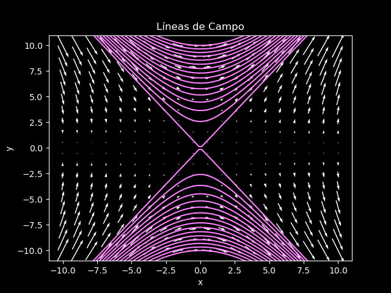

# Electromagnetismo II
## Problema E01-02

Obtener la ecuación de las líneas de campo para
$`\vec{E}=\frac{1}{\varepsilon_0}(y^2\hat{i} + 2xy\hat{j})`$ y
determinar cuál de las líneas pasa por $`(2, -1, 3)`$. (sugerencia: el campo
eléctrico es tangencial a las líneas del campo en cada uno de sus puntos 
¿por qué?).

---

**Solución**

Debido a que el campo no tiene componente en $`z`$ no necesitamos preocuparnos
por el caso tridimensional. Entonces tenemos que la ecuación diferencial
para las líneas de campo está dada por

```math
\frac{dx}{E_x} - \frac{dy}{E_y}
=
\frac{dx}{y^2} - \frac{dy}{2xy}
=
0
```

```math
\Rightarrow
2x dx - y dy = 0
\Rightarrow
x^2 - \frac{1}{2}y^2 = C
```

Para encontrar la línea que pasar por $`(2, -1, 3)`$ neceistamos a $`C`$. Para esto
sustituimos los valores del punto y obtenemos que

```math
2^2 - \frac{1}{2} 1^2 = \frac{7}{2} = C.
```

De tal forma que la línea requerida es 

```math
x^2 - \frac{1}{2}y^2 = \frac{7}{2}.
```

Las líneas del campo se ven así:


