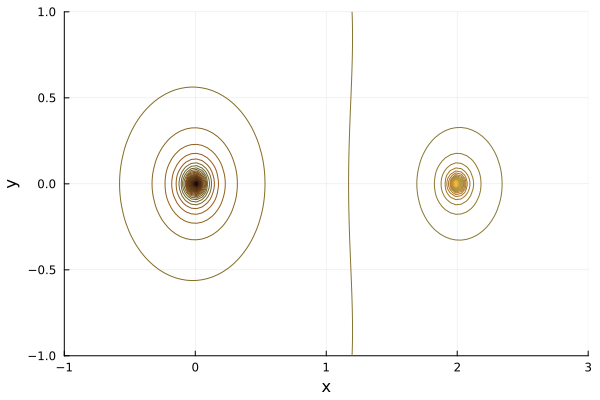

# Electromagnetismo II
## Problema 03-01

Dos cargas puntuales $`-q`$ y $`+\frac{1}{2}q`$, se sitúan en el origen y en
el punto $`(a, 0, 0)`$, respectivamente.

1. ¿En qué punto del eje $`x`$ se anula el campo eléctrico?
2. Hacer una gráfica en el plano $`xy`$ de la superficie equipotencial que 
pasa por el punto que acabamos de mencionar. ¿Es este punto un mínimo verdadero?
3. Demostrar que la superficie equipotencial $`\varphi=0`$ tiene la forma
esférica.¿Cuáles son las coordenadas del centro de esta esfera?

---

**Solución***

El campo eléctrico para un punto $`(x, 0, 0)`$ está dado por

```math
E = -k\frac{q}{x^2} + k\frac{q}{2 (x - a)^2} = 0
\Rightarrow
x = a (2 \pm \sqrt{2}).
```

Las curvas equipotenciales son las siguientes para $`kq = 1`$ y $`a = 2`$



Ahora tomemos un punto $`(x, y, 0)`$. Entonces el potencial para este punto está
dado por 

```math
V = -k\frac{q}{\sqrt{x^2 + y^2}} + k\frac{q}{2 \sqrt{(x - a)^2 + y^2}} = 0
\Rightarrow
\left(x - \frac{4}{3}a\right)^2 + y^2 = \frac{4}{9}a^2
```

es decir, encontramos la ecuación de un círculo cuyo centro está en $`\frac{4}{3}a`$.

