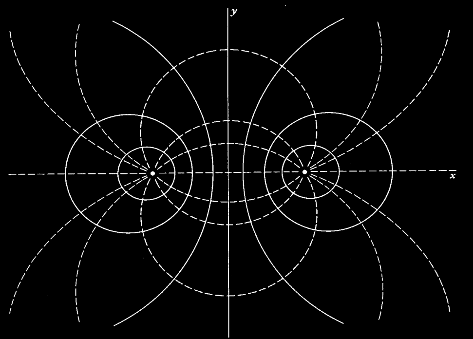

# Electromagnetismo II
# Problema 05-01

Del ejemplo visto en clase para las dos cargas lineales paralelas y de signo
opuesto,

```math
V(\rho, \varphi)
=
\frac{\lambda}{4\pi\varepsilon_0}\ln\left(\frac{\rho_-^2}{\rho_+^2}\right)
=
\frac{\lambda}{4\pi\varepsilon_0}\ln\left(\frac{
    a^2 + \rho^2 + 2a\rho\cos\varphi}{
    a^2 + \rho^2 - 2a\rho\cos\varphi
    }
\right)
```

con:

```math
E_\rho
=
-\frac{\partial V}{\partial \rho}
= 
\frac{\lambda a (\rho^2 - a^2)\cos\varphi}{\pi\varepsilon_0\rho_+^2\rho_-^2}
```

```math
E_\varphi
=
-\frac{1}{\rho}\frac{\partial V}{\partial \rho}
= 
\frac{\lambda a (\rho^2 + a^2)\sin\varphi}{\pi\varepsilon_0\rho_+^2\rho_-^2}
```

1. Demostrar que las superficies equipotenciales están dadas por:

```math
(x - a \coth\alpha)^2 + y^2 = \left(\frac{a}{\sinh\alpha}\right)^2,
```

donde $`\alpha = 2\pi\varepsilon_0 V/\lambda`$.
Y que las líneas de fuerza están dadas por:

```math
\rho^2 - a^2 = K a \rho\sin\varphi,
```

donde $`K`$ es una constante de integración.

2. Hacer una gráfica de las superficies equipotenciales y las líneas de fuerza
para el plano $`xy`$.

***Nota:*** En la expresión para $`E_\varphi`$ originalmente era $`\rho^2 - a^2`$ pero
el signo debe ser $`+`$.

---

**Solución**

Para las superficies equipotenciales ocurre que $`V=cte.`$ de tal forma que

```math
\frac{\rho_-^2}{\rho_+^2} = e^{4\pi\varepsilon_0 V/\lambda} = cte.
```
Y en coordenadas rectangulares esto es 

```math
\frac{(x - a)^2 + y^2}{(x + a)^2 + y^2} = e^{4\pi\varepsilon_0 V/\lambda}.
```

Ahora, dejemos que $`b = e^{2\pi\varepsilon_0 V/\lambda} = e^\alpha`$ para simplificar
la notación. Entonces podemos reacomodar la expresión anterior para que quede

```math
\left(x - a\frac{b^2 + 1}{b^2 - 1}\right)^2 + y^2 = a\left(\frac{2b}{b^2 -1}\right)
```

```math
\Rightarrow
(x - a \coth\alpha)^2 + y^2 = \left(\frac{a}{\sinh\alpha}\right)^2,
```

Para encontrar las líneas de fuerza tomamos

```math
\frac{1}{\rho}\frac{\partial\rho}{\partial\varphi}
=
\frac{E_\rho}{E_\varphi}
=
\frac{(\rho^2 - a^2)\cos\varphi}{(\rho^2 + a^2)\sin\varphi}
```

```math
\Rightarrow
\frac{(\rho^2 + a^2)}{\rho(\rho^2 - a^2)}d\rho = \frac{cos\varphi}{\sin\varphi}d\varphi
```

```math
\Rightarrow
\ln\left(\frac{\rho^2 - a^2}{a\rho}\right) = \ln\sin\varphi + \ln K
```

```math
\Rightarrow
\rho^2 - a^2 = K a \rho\sin\varphi,
```

Y la gráfica es



Las líneas sólidas son las equipotenciales y los guiones las líneas de fuerza.
