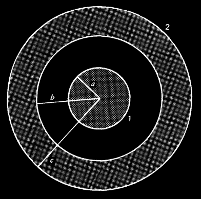

# Electromagnetismo II
## Problema 06-02

Encontrar la energía de un sistema en donde una carga $`-Q`$ se encuentra en
la esfera interior de un capacitor esférico y una carga $`+Q`$ en la esfera
exterior como se muestra en la figura. El radio de la esfera interior es $`a`$,
es la distancia entre la esfera exterior y la interior es $`b-a`$, y el radio
de la esfera exterior es $`c`$.

