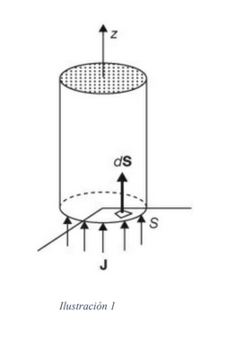

# Electromagnetismo II
# Problema T11-01

Encontrar la corriente en el alambre circular que aparece en la ilustración 1
si la densidad de corriente es
$`\vec{J} = 15(1 - e^{-200r})\hat{k}\ \mathrm{A/m^2}`$. El radio del alambre es
2 mm.

