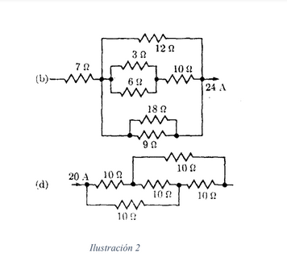

# Electromagnetismo II
## Problema T11-03

Encontrar las resistencias equivalantes entre los arreglos que muestran en la
ilustración 2. Encontrar la corriente y la diferencia de potencial en cada 
resistencia.



---

### Solución

#### a)

Analizamos la parte derecha del circuito y a esta la dividimos en tres:
arriba, medio y abajo. La parte de en medio consiste en tres resistencias,
dos en paralelo conectadas en serie con otra. Y su resistencia equivalente
es

```math
R_\text{medio} = \frac{1}{\frac{1}{3} + \frac{1}{6}} + 10 = 12\ \Omega
```

La parte de abajo es más sencilla

```math
R_\text{abajo} = \frac{1}{\frac{1}{18} + \frac{1}{9}} = 6\ \Omega
```

De tal forma que todo el lado derecho es equivalente a

```math
R_\text{derecha}
= \frac{1}{\frac{1}{12} + \frac{1}{12} + \frac{1}{6}}
= 3\ \Omega
```

Así que todo el circuito equivale a 

```math
R_\text{equivalente} = 7 + 3 = 10\ \Omega
```

Entonces, trabajando con la ley de Ohm encontramos los siguientes resultados

| R ($`\Omega`$) | V (V) | I (A) |
| -------------- | ----- | ----- |
| 3              | 12    | 4     |
| 6              | 12    | 2     |
| 7              | 168   | 24    |
| 9              | 72    | 8     |
| 10             | 60    | 6     |
| 12             | 72    | 6     |
| 18             | 72    | 4     |

#### b)

En los nodos tenemos 

```math
\begin{align}
I_0 &= I_1 + I_2 \\
I_2 &= I_3 + I_4 \\
I_5 &= I_1 + I_4
\end{align}
```

De los bucles $`abca`$, $`abcda`$ y $`bdcb`$

```math
\begin{align}
-I_2 R - I_4 R + I_1 R &= 0 \\
-I_2 R - I_3 R + V     &= 0 \\
-I_3 R + I_5 R + I_4 R &= 0 \\
\end{align}
```

Resolviendo estas ecuaciones tenemos que 

| Corriente | Voltaje |
| --------- | ------- |
| 10        |         |
| 10        |         |
| 10        |         |
| 0         |         |
| 10        |         |

Y la diferencia de potencial para todo el circuito es 200 V.
