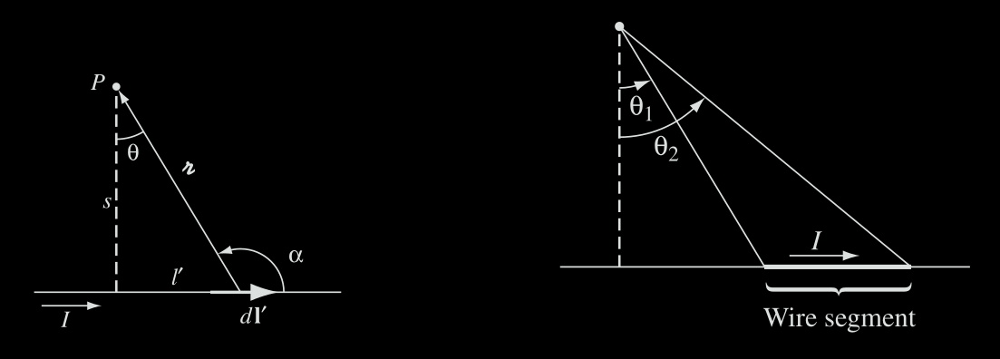

# Electromagnetismo II
## Problema T12-02

Encontrar el campo magnetico a una distancia $`s`$ de un alambre recto y largo
por el cual circula una corriente estacionaria $`\vec{I}`$.

---

**Solución**



En el diagrama $`d\vec{l}'\times\hat{r}`$ se sale de la pantalla, y tiene una
magnitud

```math
dl' \sin\alpha = dl' \cos\theta
```

Además, $`l' = s\tan\theta`$; por lo tanto

```math
dl' = \frac{s}{\cos^2\theta} d\theta.
```

También $`s = r\cos\theta`$. Entonces

```
\frac{1}{r^2} = \frac{\cos^2\theta}{s^2}.
```

```math
\Rightarrow
\begin{align}
\vec{B} &= \frac{\mu_0 \vec{I}}{4\pi} \int_{\theta_1}^{\theta_2}
\left(\frac{\cos^2\theta}{s^2}\right)
\left(\frac{s}{\cos^2\theta}\right)\cos\theta d\theta \\
&= \frac{\mu_0 \vec{I}}{4\pi s} \int_{\theta_1}^{\theta_2} \cos\theta d\theta \\
&= \frac{\mu_0 \vec{I}}{4\pi s} (\sin\theta_2 - \sin\theta_1).
\end{align}
```

Ahora, para que se trate de un alambre infinito tomamos $`\theta_1 = -\pi /2`$
y $`\theta_2 = \pi / 2`$. Así obtenemos

```math
\vec{B} = \frac{\mu_0 \vec{I}}{2\pi s}.
```
