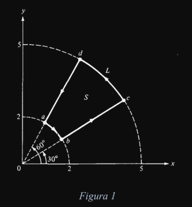

# Electromagnetismo II
## Problema T13-01

Utilizar los teoremas de Stokes y de Green para resolver:

**Teorema de Stokes:**
$`\int_S (\nabla \times \vec{v})\cdot d\vec{a} = \oint_P \vec{v}\cdot d\vec{l}`$
en donde $`S`$ es una superficie y $`P`$ es la frontera de esa superficie
(perímetro).

- Si $`\vec{A} = r\cos\theta\hat{r} + \sin\theta\hat{\theta}`$ evaluar
$`\oint\vec{A}\cdot d\vec{l}`$ en torno a la trayectoria que aparece en la
Figura 1. Confirmar el resultado aplicando el teorema de Stokes.

**Teorema de Green:**
$`\int_V (\nabla \cdot \vec{u}) dv = \oint_S \vec{u}\cdot d\vec{a}`$
en donde $`V`$ es una región (de volumen $`V`$) y $`S`$ es la frontera de esa
región (una superficie).

- Utilizar el teorema de Green (o de la divergencia) para la función
$`\vec{A} = (xy)\hat{i} + (2yz)\hat{j} + (3zx)\hat{k}`$. Utilizar un cubo de
lado dos para mostrarlo.



---

**Solución**

Para el primer inciso dividimos la integral en cuatro partes.

```math
\begin{align}
I &= I_{a\to b} + I_{b\to c} + I_{c\to d} + I_{d\to a} \\
&= \int_{\pi/3}^{\pi/6} \sin\theta 2 d\theta +
\int_2^5 r \cos(\pi/6) dr + 
\int_{\pi/6}^{\pi/3} \sin\theta 5 d\theta +
\int_5^2 r \cos(\pi/3) dr  \\
&= (5 - 2) int_{\pi/6}^{\pi/3} \sin\theta d\theta +
[\cos(\pi/6) - \cos(\pi/3)] \int_2^5 r dr  \\
&= \frac{27}{4}(\sqrt{3} - 1).
\end{align}
```

Ahora, usando el teorema de Stokes

```math
\begin{align}
I &= \int_S (\nabla \times \vec{v})\cdot d\vec{a} \\
&= \int_2^5\int_{\pi/6}^{\pi/3}
\left(\frac{\sin\theta (1 + r)}{r}\right) \hat{\phi} \cdot
rdrd\theta \hat{\phi} \\
&= \frac{27}{4}(\sqrt{3} - 1).
\end{align}
```

Ahora, usando el teorema de Green, del lado izquierdo tenemos que

```math
\begin{align}
\int_V (\nabla \cdot \vec{u}) dv 
&= \int_0^2\int_0^2\int_0^2\nabla\cdot\vec{A} dxdydz \\
&= \int_0^2\int_0^2\int_0^2 (y + 2z + 3x) dxdydz \\
&= \int_0^2\int_0^2\left.(yx + 2zx + \frac{3}{2}x^2)\right|_0^2 dydz \\
&= \int_0^2\int_0^2(2y + 4z + 6) dydz \\
&= \int_0^2\left.(y^2 + 4zy + 6y)\right|_0^2 dz \\
&= \int_0^2 (8z + 16) dz \\
&= \left.(4z^2 + 16z)\right|_0^2 \\
&= 48
\end{align}
```

Ahora, del lado derecho, colocamos el cubo con un vértice en el origen y
dentro del primer octeto. Entonces dividimos la integral en 6 partes.

En el plano en $`x=0`$

```math
\begin{align}
\int\int \vec{A}\cdot-\hat{i} dydz
&= \int_0^2\int_0^2 0 dydz \\
&= 0
\end{align}
```

En el plano en $`x=2`$

```math
\begin{align}
\int\int \vec{A}\cdot\hat{i} dydz
&= \int_0^2\int_0^2 2y dydz \\
&= \int_0^2 4 dz \\
&= 8
\end{align}
```
En el plano en $`y=0`$

```math
\begin{align}
\int\int \vec{A}\cdot-\hat{j} dxdz
&= \int_0^2\int_0^2 0 dxdz \\
&= 0
end{align}
```

En el plano en $`y=2`$

```math
\begin{align}
\int\int \vec{A}\cdot\hat{j} dxdz
&= \int_0^2\int_0^2 4z dxdz \\
&= \int_0^2 8 dz \\
&= 16
\end{align}

En el plano en $`z=0`$

```math
\begin{align}
\int\int \vec{A}\cdot-\hat{k} dxdy
&= \int_0^2\int_0^2 0 dxdy \\
&= 0
\end{align}
```

En el plano en $`z=2`$

```math
\begin{align}
\int\int \vec{A}\cdot\hat{k} dxdy
&= \int_0^2\int_0^2 6x dxdy \\
&= \int_0^2 12 dz \\
&= 24
\end{align}

Entonces sumando las partes obtenemos que 

```math
\oint_S \vec{A}\cdot d\vec{s} = 48 = \int_V (\nabla \cdot \vec{A}) dv 
```
