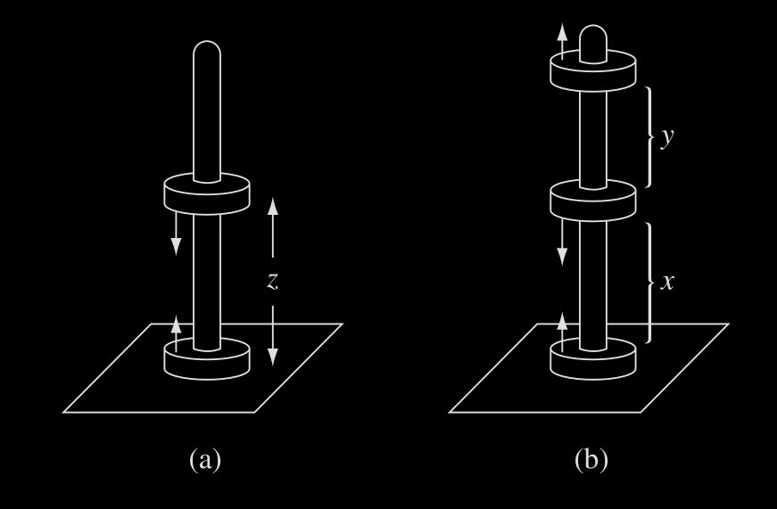

# Electromagnetismo II
## Problema T14-04

En la interfase entre dos materiales magnéticos lineales, el campo magnético
se dobla, como la figura 2. Mostrar que
$`\tan\theta_2/\tan\theta_1 = \mu_2/\mu_1`$ suponiendo que no hay corrientes
libres en la frontera. (Análogamente, esto ocurre en la interfase entre dos
medios dieléctricos lineales, en que las líneas de campo eléctrico se doblan.
Esto parece recordar la ley de Snell en Óptica. ¿Sugiere algo?



---

**Solución**

En la interfaz la componente perpendicular de $\vec{B}$ es continua, mientras que
la componente paralela de $\vec{H}$ es continua. Entonces

```math
\begin{align}
B_1^\perp &= B_2^\perp \\
H_1^\parallel = H_2^\parallel.
\end{align}
```

Y también tenemos que $`\vec{B} = \mu\vec{H}`$. Entonces

```math
\frac{1}{\mu_1}B_1^\parallel = \frac{1}{\mu_2}B_2^\parallel
```

```math
\begin{align}
\frac{\tan\theta_2}{\tan\theta_1} 
&= \frac{B_2^\parallel / B_2^\perp}{B_1^\parallel / B_1^\perp} \\
&= \frac{B_2^\parallel B_1^\perp }{B_1^\parallel B_2^\perp} \\
&= \frac{B_2^\parallel}{B_1^\parallel} \\
&= \frac{\mu_2}{\mu_1}
\end{align}
```
